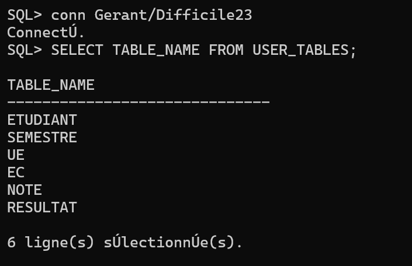
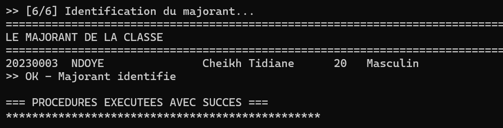
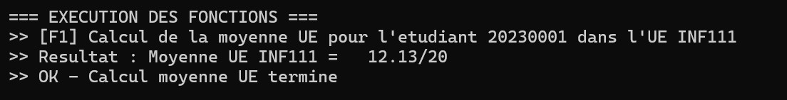
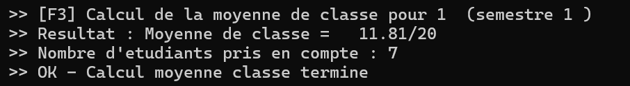
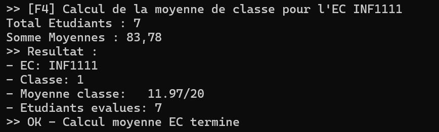
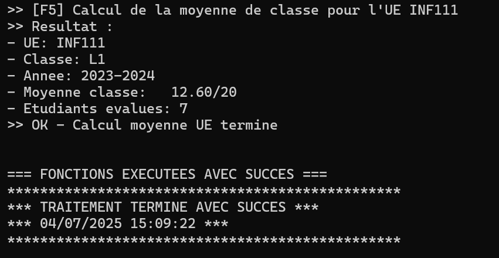
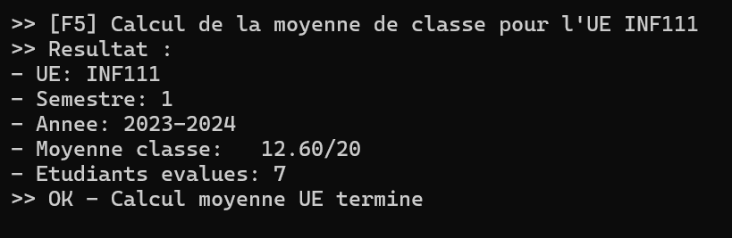

# Système de Gestion Universitaire – UASZ

## Sommaire

- [Description](#description)
- [Schéma de base de données](#schéma-de-base-de-données)
- [Fonctionnalités](#fonctionnalités)
  - [Fonctions académiques](#fonctions-académiques)
  - [Reporting & Procédures](#reporting--procédures)
- [Configuration initiale](#configuration-initiale)
- [Technologies utilisées](#technologies-utilisées)
- [Résultats](#résultats)
  - [Lister les tables](#lister-les-tables)
  - [Description de la table Étudiant](#description-de-la-table-étudiant)
  - [Description de la table Semestre](#description-de-la-table-semestre)
  - [Description de la table UE](#description-de-la-table-ue)
  - [Description de la table EC](#description-de-la-table-ec)
  - [Description de la table Note](#description-de-la-table-note)
  - [Description de la table Résultat](#description-de-la-table-résultat)
  - [Lister les triggers](#lister-les-triggers)
  - [Lister les procédures](#lister-les-procédures)
  - [Lister les fonctions](#lister-les-fonctions)
  - [Exécution du programme principal](#exécution-du-programme-principal)
  - [Liste des étudiants par ordre de mérite](#liste-des-étudiants-par-ordre-de-mérite)
  - [Relevé de notes d’un étudiant](#relevé-de-notes-dun-étudiant)
  - [Liste des EC validés](#liste-des-ec-validés)
  - [Liste des étudiants ayant validé un semestre](#liste-des-étudiants-ayant-validé-un-semestre)
  - [Major de promotion](#major-de-promotion)
- [Fonctions de calculs académiques](#fonctions-de-calculs-académiques)
  - [Moyenne d’un étudiant pour une UE donnée](#moyenne-dun-étudiant-pour-une-ue-donnée)
  - [Moyenne semestrielle d’un étudiant](#moyenne-semestrielle-dun-étudiant)
  - [Moyenne de classe pour un semestre](#moyenne-de-classe-pour-un-semestre)
  - [Moyenne de classe pour un EC](#moyenne-de-classe-pour-un-ec)
  - [Moyenne de classe pour une UE](#moyenne-de-classe-pour-une-ue)
- [Encadrant](#encadrant)
- [Auteurs](#auteurs)

## Description

Ce projet est un système complet de gestion académique développé en **Oracle SQL et PL/SQL** pour l’Université Assane Seck de Ziguinchor. Il permet d’automatiser plusieurs aspects liés à la gestion des étudiants, des notes, des unités d’enseignement, et des résultats académiques. Ce système est conçu dans le cadre du cours de **Base de Données Avancée (Master 1 Informatique, 2023-2024)**.

## Schéma de base de données

Les principales entités du système sont :

* **Etudiant** (Matricule, Nom, Prénom, Âge, Sexe, Email, Niveau)
* **Semestre** (Numéro, Cycle, Année)
* **UE** (Code, Libellé, Coefficient, Crédit, #Semestre, #Cycle)
* **EC** (Code, Libellé, Coefficient, Crédit, #UE)
* **Note** (#Etudiant, #EC, Année, Contrôle, Examen, Moyenne)
* **Résultat** (#Etudiant, #Semestre, #Cycle, Année, Moyenne, Résultat, Mention, Rang)

## Fonctionnalités

### Fonctions académiques

* Calcul de moyennes :

  * Moyenne d’une UE
  * Moyenne semestrielle d’un étudiant
  * Moyenne d’un EC
  * Moyenne de classe
* Attribution automatique :

  * Matricule étudiant
  * Codes des UE et EC
  * Adresses email des étudiants
* Vérifications automatiques :

  * Validité du sexe (Masculin ou Féminin)
  * Validité du résultat (Validé ou Ajourné)

### Reporting & Procédures

* Classement des étudiants par ordre de mérite
* Relevé de notes par étudiant
* Liste des EC validés par étudiant
* Liste des étudiants ayant validé un semestre
* Identification du **major de promotion**

## Configuration initiale

* Création de la base `Deliberation` (sans archivage, mémoire par défaut)
* Création de deux utilisateurs :

  * `gerant` (admin complet)
  * `employe` (droits limités au calcul et affichage)

## Technologies utilisées

* **Oracle SQL / PL-SQL**
* SQL Developer ou tout autre IDE compatible

## Résultats

Cette section présente quelques résultats générés automatiquement par le système via les procédures, fonctions et triggers PL/SQL.

### Lister les tables
Affichage des tables disponibles dans la base de données `Deliberation`.

### Description de la table Étudiant
Structure de la table `Etudiant` contenant les informations personnelles des étudiants.

### Description de la table Semestre
Structure de la table `Semestre`, qui contient les numéros, cycles et années des semestres.

### Description de la table UE
Structure de la table `UE`, représentant les Unités d’Enseignement.

### Description de la table EC
Structure de la table `EC` (Éléments Constitutifs) liés aux UE.

### Description de la table Note
Structure de la table `Note`, qui stocke les notes de contrôle, examen, et moyennes.

### Description de la table Résultat
Structure de la table `Resultat`, qui contient les moyennes semestrielles, résultats, mentions et rangs.

### Lister les triggers
Liste des triggers créés dans la base pour automatiser les tâches (matricule, email, calculs...).

### Lister les procédures
Liste des procédures stockées utilisées pour les calculs et l'affichage des résultats.

### Lister les fonctions
Liste des fonctions créées pour calculer les moyennes et autres indicateurs académiques.

### Exécution du programme principal
Lancement du script principal exécutant l’ensemble des calculs et procédures.

### Liste des étudiants par ordre de mérite
Procédure listant les étudiants triés selon leurs performances pour un semestre.

### Relevé de notes d’un étudiant
Génération du relevé de notes pour un étudiant spécifique.

### Liste des EC validés
Procédure affichant les EC validés par un étudiant pour un semestre.

### Liste des étudiants ayant validé un semestre
Procédure affichant les étudiants ayant validé un semestre.

### Major de promotion
Identification de l’étudiant ayant obtenu la meilleure moyenne de sa classe.

##  Fonctions de calculs académiques

### Moyenne d’un étudiant pour une UE donnée
Fonction qui calcule la moyenne d’un étudiant pour une UE d’un semestre.

### Moyenne semestrielle d’un étudiant
Fonction qui calcule la moyenne semestrielle d’un étudiant pour une année donnée.

### Moyenne de classe pour un semestre
Fonction qui retourne la moyenne générale d’une classe pour un semestre donné.

### Moyenne de classe pour un EC
Fonction qui retourne la moyenne générale obtenue pour un EC donné.

### Moyenne de classe pour une UE
Fonction qui retourne la moyenne générale obtenue pour une UE donnée.

## Encadrant

**Dr. Serigne DIAGNE**
Département Informatique, UFR Sciences et Technologies, Université Assane Seck de Ziguinchor

## Auteurs
- **El Hadji Abdou DRAME**
- **Djiby FALL**